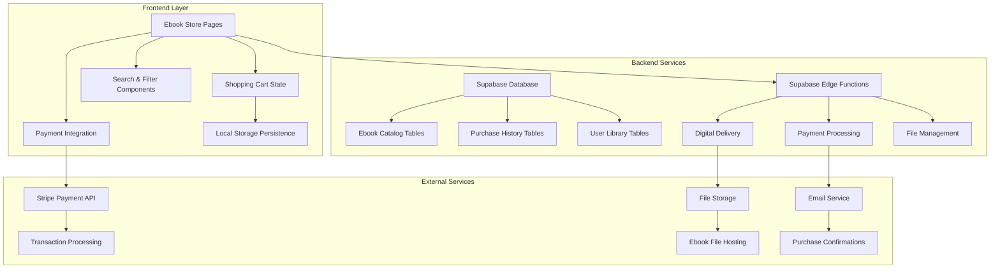

# Design Document: Ebook Ecommerce Store

## Overview

The Ebook Ecommerce Store feature integrates a digital bookstore into the existing Open Ear emotional support application. This feature enables users to browse, purchase, and access mental wellness ebooks through a seamless shopping experience that leverages the existing Stripe payment infrastructure and Supabase backend.

The design maintains consistency with Open Ear's existing design system while introducing new components for catalog browsing, shopping cart management, and digital content delivery. The system prioritizes user experience with responsive design, fast search capabilities, and reliable digital delivery mechanisms.

## Architecture

### System Architecture Overview



### Integration Points

The ebook store integrates with existing Open Ear infrastructure:

- **Authentication**: Uses existing Supabase auth system
- **Payment Processing**: Leverages existing Stripe integration (@stripe/react-stripe-js)
- **Database**: Extends current Supabase schema with new ebook-related tables
- **Email Notifications**: Uses existing Resend integration for purchase confirmations
- **Routing**: Adds new routes to existing React Router configuration
- **Styling**: Follows existing Tailwind CSS design system and color scheme

## Components and Interfaces

### Frontend Components

#### Core Store Components

**EbookStorePage** (`/src/pages/ebook-store/page.tsx`)
- Main storefront displaying ebook catalog
- Integrates search, filtering, and category navigation
- Responsive grid layout for ebook cards
- Pagination for large catalogs

**EbookDetailPage** (`/src/pages/ebook-detail/page.tsx`)
- Detailed view for individual ebooks
- Displays full description, author info, sample pages
- Add to cart functionality
- Ownership status checking

**ShoppingCartPage** (`/src/pages/cart/page.tsx`)
- Cart contents management
- Price calculations and totals
- Checkout initiation
- Item removal capabilities

**UserLibraryPage** (`/src/pages/library/page.tsx`)
- Personal ebook collection
- Download links for owned content
- Purchase history integration
- Re-download capabilities

#### Reusable Components

**EbookCard** (`/src/components/ebook/EbookCard.tsx`)
```typescript
interface EbookCardProps {
  ebook: Ebook;
  onAddToCart: (ebookId: string) => void;
  isOwned: boolean;
  showPrice: boolean;
}
```

**SearchBar** (`/src/components/ebook/SearchBar.tsx`)
```typescript
interface SearchBarProps {
  onSearch: (query: string) => void;
  placeholder: string;
  initialValue?: string;
}
```

**FilterPanel** (`/src/components/ebook/FilterPanel.tsx`)
```typescript
interface FilterPanelProps {
  categories: Category[];
  priceRange: PriceRange;
  onFilterChange: (filters: FilterState) => void;
  activeFilters: FilterState;
}
```

**ShoppingCartWidget** (`/src/components/ebook/ShoppingCartWidget.tsx`)
```typescript
interface ShoppingCartWidgetProps {
  itemCount: number;
  totalPrice: number;
  onToggleCart: () => void;
}
```

### Backend API Interfaces

#### Supabase Edge Functions

**get-ebooks** (`/supabase/functions/get-ebooks/index.ts`)
- Retrieves ebook catalog with filtering and pagination
- Supports search across title, author, description
- Returns formatted ebook data with metadata

**process-ebook-purchase** (`/supabase/functions/process-ebook-purchase/index.ts`)
- Handles Stripe payment processing for ebook purchases
- Creates purchase records and updates user library
- Triggers digital delivery and email notifications

**get-user-library** (`/supabase/functions/get-user-library/index.ts`)
- Retrieves user's owned ebooks
- Generates secure download links
- Tracks download attempts and limits

**upload-ebook** (`/supabase/functions/upload-ebook/index.ts`)
- Admin function for adding new ebooks
- Validates file formats and metadata
- Updates catalog with new entries

#### API Response Interfaces

```typescript
interface Ebook {
  id: string;
  title: string;
  author: string;
  description: string;
  short_description: string;
  price: number;
  category: string;
  cover_image_url: string;
  file_url: string;
  file_format: 'PDF' | 'EPUB';
  file_size: number;
  publication_date: string;
  isbn?: string;
  sample_pages_url?: string;
  created_at: string;
  updated_at: string;
}

interface Purchase {
  id: string;
  user_id: string;
  ebook_id: string;
  stripe_payment_intent_id: string;
  amount_paid: number;
  purchase_date: string;
  status: 'completed' | 'pending' | 'failed';
}

interface UserLibrary {
  id: string;
  user_id: string;
  ebook_id: string;
  purchase_id: string;
  download_count: number;
  last_downloaded: string;
  added_date: string;
}
```

## Data Models

### Database Schema Extensions

#### Ebooks Table
```sql
CREATE TABLE ebooks (
  id UUID PRIMARY KEY DEFAULT gen_random_uuid(),
  title VARCHAR(255) NOT NULL,
  author VARCHAR(255) NOT NULL,
  description TEXT,
  short_description VARCHAR(500),
  price DECIMAL(10,2) NOT NULL,
  category VARCHAR(100) NOT NULL,
  cover_image_url TEXT,
  file_url TEXT NOT NULL,
  file_format VARCHAR(10) NOT NULL CHECK (file_format IN ('PDF', 'EPUB')),
  file_size BIGINT,
  publication_date DATE,
  isbn VARCHAR(20),
  sample_pages_url TEXT,
  is_active BOOLEAN DEFAULT true,
  created_at TIMESTAMP WITH TIME ZONE DEFAULT NOW(),
  updated_at TIMESTAMP WITH TIME ZONE DEFAULT NOW()
);

CREATE INDEX idx_ebooks_category ON ebooks(category);
CREATE INDEX idx_ebooks_price ON ebooks(price);
CREATE INDEX idx_ebooks_active ON ebooks(is_active);
```

#### Purchases Table
```sql
CREATE TABLE ebook_purchases (
  id UUID PRIMARY KEY DEFAULT gen_random_uuid(),
  user_id UUID NOT NULL REFERENCES auth.users(id),
  ebook_id UUID NOT NULL REFERENCES ebooks(id),
  stripe_payment_intent_id VARCHAR(255) NOT NULL,
  amount_paid DECIMAL(10,2) NOT NULL,
  purchase_date TIMESTAMP WITH TIME ZONE DEFAULT NOW(),
  status VARCHAR(20) DEFAULT 'pending' CHECK (status IN ('completed', 'pending', 'failed')),
  receipt_url TEXT,
  created_at TIMESTAMP WITH TIME ZONE DEFAULT NOW()
);

CREATE INDEX idx_purchases_user ON ebook_purchases(user_id);
CREATE INDEX idx_purchases_status ON ebook_purchases(status);
```

#### User Library Table
```sql
CREATE TABLE user_ebook_library (
  id UUID PRIMARY KEY DEFAULT gen_random_uuid(),
  user_id UUID NOT NULL REFERENCES auth.users(id),
  ebook_id UUID NOT NULL REFERENCES ebooks(id),
  purchase_id UUID NOT NULL REFERENCES ebook_purchases(id),
  download_count INTEGER DEFAULT 0,
  last_downloaded TIMESTAMP WITH TIME ZONE,
  added_date TIMESTAMP WITH TIME ZONE DEFAULT NOW(),
  UNIQUE(user_id, ebook_id)
);

CREATE INDEX idx_library_user ON user_ebook_library(user_id);
```

#### Categories Table
```sql
CREATE TABLE ebook_categories (
  id UUID PRIMARY KEY DEFAULT gen_random_uuid(),
  name VARCHAR(100) NOT NULL UNIQUE,
  description TEXT,
  display_order INTEGER DEFAULT 0,
  is_active BOOLEAN DEFAULT true,
  created_at TIMESTAMP WITH TIME ZONE DEFAULT NOW()
);

INSERT INTO ebook_categories (name, description, display_order) VALUES
('Mental Wellness', 'Books focused on overall mental health and wellness', 1),
('Self-Help', 'Practical guides for personal development', 2),
('Anxiety Management', 'Resources for understanding and managing anxiety', 3),
('Depression Support', 'Materials for coping with depression', 4),
('Mindfulness', 'Meditation and mindfulness practices', 5),
('Relationships', 'Building healthy relationships and communication', 6);
```

### State Management

#### Shopping Cart State
```typescript
interface CartItem {
  ebook: Ebook;
  quantity: number; // Always 1 for digital products
  addedAt: string;
}

interface CartState {
  items: CartItem[];
  totalItems: number;
  totalPrice: number;
  isOpen: boolean;
}

interface CartActions {
  addItem: (ebook: Ebook) => void;
  removeItem: (ebookId: string) => void;
  clearCart: () => void;
  toggleCart: () => void;
}
```

#### Search and Filter State
```typescript
interface FilterState {
  categories: string[];
  priceRange: {
    min: number;
    max: number;
  };
  author: string;
  sortBy: 'title' | 'price' | 'publication_date' | 'popularity';
  sortOrder: 'asc' | 'desc';
}

interface SearchState {
  query: string;
  filters: FilterState;
  results: Ebook[];
  totalCount: number;
  currentPage: number;
  isLoading: boolean;
}
```

## Correctness Properties

*A property is a characteristic or behavior that should hold true across all valid executions of a system-essentially, a formal statement about what the system should do. Properties serve as the bridge between human-readable specifications and machine-verifiable correctness guarantees.*

### Property 1: Ebook Display Completeness

*For any* ebook in the catalog, the display function should include title, author, description, price, and cover image information.

**Validates: Requirements 1.1**

### Property 2: Category Organization

*For any* ebook in the system, it should be assigned to a valid category from the predefined set (mental wellness, self-help, anxiety management, depression support).

**Validates: Requirements 1.2**

### Property 3: Category Filtering

*For any* category filter selection and ebook collection, the filtered results should contain only ebooks that match the selected category.

**Validates: Requirements 1.3**

### Property 4: Search Functionality

*For any* search query and ebook collection, all returned results should contain the search term in at least one of the following fields: title, author, or description.

**Validates: Requirements 1.4, 8.1**

### Property 5: Detail View Completeness

*For any* ebook detail view, it should display full description, author biography, table of contents, sample pages, file format, and file size information.

**Validates: Requirements 2.1, 2.2**

### Property 6: Ownership-Based Display

*For any* ebook and user combination, if the user owns the ebook, the display should show "Already Owned" instead of purchase options.

**Validates: Requirements 2.5**

### Property 7: Cart Addition

*For any* available ebook, adding it to the cart should increase the cart count by one and include the ebook in the cart contents.

**Validates: Requirements 3.1**

### Property 8: Cart Total Calculation

*For any* shopping cart with items, the displayed total should equal the sum of all individual item prices.

**Validates: Requirements 3.2**

### Property 9: Cart Item Removal

*For any* item in the shopping cart, removing it should decrease the cart count and remove the item from cart contents.

**Validates: Requirements 3.3**

### Property 10: Cart Persistence

*For any* authenticated user with cart items, the cart contents should persist across browser sessions.

**Validates: Requirements 3.4**

### Property 11: Empty Cart State

*For any* empty shopping cart, the checkout functionality should be disabled and an appropriate message should be displayed.

**Validates: Requirements 3.5**

### Property 12: Payment Processing Integration

*For any* checkout attempt, the system should initiate Stripe payment processing with the correct cart total and items.

**Validates: Requirements 4.1**

### Property 13: Payment Status Handling

*For any* payment transaction, the system should return either a success or failure status with appropriate next actions.

**Validates: Requirements 4.3**

### Property 14: Payment Failure Recovery

*For any* failed payment, the cart contents should be preserved and retry options should be available.

**Validates: Requirements 4.4, 10.2**

### Property 15: Purchase Completion Flow

*For any* successful payment, the system should generate a receipt and trigger digital delivery to the user's library.

**Validates: Requirements 4.5**

### Property 16: Library Addition

*For any* confirmed purchase, the purchased ebooks should be added to the user's personal library.

**Validates: Requirements 5.1**

### Property 17: Download Link Generation

*For any* purchased ebook in a user's library, download links should be available in all supported formats.

**Validates: Requirements 5.2, 6.4**

### Property 18: Purchase Confirmation Email

*For any* completed purchase, a confirmation email with download instructions should be sent to the user.

**Validates: Requirements 5.3**

### Property 19: Unlimited Re-downloads

*For any* ebook in a user's library, the user should be able to download it multiple times without restrictions.

**Validates: Requirements 5.4**

### Property 20: Purchase History Completeness

*For any* ebook purchase, it should be recorded in the user's purchase history with transaction date, ebook title, price, and payment status.

**Validates: Requirements 6.1, 6.2**

### Property 21: Library Completeness

*For any* user's library, it should contain all ebooks that the user has successfully purchased.

**Validates: Requirements 6.3**

### Property 22: Receipt Access

*For any* completed purchase, the user should be able to access and download a receipt for the transaction.

**Validates: Requirements 6.5**

### Property 23: File Format Support

*For any* ebook upload attempt, the system should accept PDF and EPUB formats and reject other formats.

**Validates: Requirements 7.1**

### Property 24: File Validation

*For any* uploaded ebook file, the system should validate file integrity and format compatibility before making it available for purchase.

**Validates: Requirements 7.2**

### Property 25: Metadata Storage

*For any* ebook in the catalog, all required metadata (title, author, description, category, pricing) should be stored and retrievable.

**Validates: Requirements 7.3**

### Property 26: Ebook Information Updates

*For any* existing ebook, its information and files should be updatable through the catalog management system.

**Validates: Requirements 7.4**

### Property 27: Corruption Detection

*For any* corrupted ebook file, the system should detect the corruption and prevent new purchases until the issue is resolved.

**Validates: Requirements 7.5**

### Property 28: Multi-Field Filtering

*For any* combination of filters (price range, category, author, publication date), the results should match all selected criteria.

**Validates: Requirements 8.2, 8.4**

### Property 29: Sorting Functionality

*For any* sort option (price, popularity, publication date, alphabetical), the results should be correctly ordered according to the selected criteria.

**Validates: Requirements 8.3**

### Property 30: Search Result Feedback

*For any* search query, the system should display accurate result counts and provide clear feedback when no results are found.

**Validates: Requirements 8.5**

### Property 31: Responsive Layout Adaptation

*For any* screen size (mobile, tablet, desktop), the ebook store layout should adapt appropriately while maintaining functionality.

**Validates: Requirements 9.2**

### Property 32: Cross-Device Cart Functionality

*For any* device type, the shopping cart should remain accessible and fully functional.

**Validates: Requirements 9.3**

### Property 33: Load Failure Error Handling

*For any* ebook store load failure, the system should display a user-friendly error message with retry options.

**Validates: Requirements 10.1**

### Property 34: Download Failure Recovery

*For any* failed ebook download, the system should provide alternative download methods and support contact information.

**Validates: Requirements 5.5, 10.3**

### Property 35: Maintenance Mode Communication

*For any* system maintenance period, the ebook store should display appropriate notices with estimated restoration times.

**Validates: Requirements 10.5**

## Error Handling

### Error Categories and Responses

#### Network and Connectivity Errors
- **Connection Timeouts**: Display retry options with exponential backoff
- **API Failures**: Show user-friendly messages while logging technical details
- **File Download Interruptions**: Provide resume capabilities and alternative download methods

#### Payment Processing Errors
- **Card Declined**: Clear messaging with retry options and alternative payment methods
- **Stripe API Errors**: Preserve cart state and offer customer support contact
- **Transaction Failures**: Automatic retry with user notification and fallback options

#### File and Content Errors
- **Corrupted Files**: Automatic detection with admin notifications and purchase prevention
- **Missing Content**: Graceful degradation with placeholder content and support contact
- **Format Incompatibility**: Clear error messages with supported format information

#### User Input Validation
- **Invalid Search Queries**: Sanitize input and provide search suggestions
- **Malformed Filters**: Reset to default values with user notification
- **Empty Required Fields**: Inline validation with helpful error messages

### Error Recovery Mechanisms

#### Automatic Recovery
- Retry failed API calls with exponential backoff (max 3 attempts)
- Cache critical data locally to handle temporary connectivity issues
- Graceful degradation when non-essential features fail

#### User-Initiated Recovery
- Manual retry buttons for failed operations
- Alternative access methods for download failures
- Clear escalation paths to customer support

#### Administrative Recovery
- Automated error logging and alerting for critical failures
- Admin dashboard for monitoring system health and user issues
- Bulk operations for resolving widespread issues

## Testing Strategy

### Dual Testing Approach

The ebook ecommerce store will employ both unit testing and property-based testing to ensure comprehensive coverage and correctness validation.

#### Unit Testing Focus
Unit tests will verify specific examples, edge cases, and integration points:

- **Component Integration**: Testing React component interactions with Supabase and Stripe
- **Edge Cases**: Empty cart states, network failures, invalid file formats
- **User Workflows**: Complete purchase flows, library access, search operations
- **Error Conditions**: Payment failures, download errors, validation failures

#### Property-Based Testing Configuration

Property tests will verify universal properties across all inputs using **fast-check** (JavaScript property-based testing library):

- **Minimum 100 iterations** per property test to ensure comprehensive input coverage
- Each property test references its corresponding design document property
- **Tag format**: `Feature: ebook-ecommerce-store, Property {number}: {property_text}`

#### Property Test Examples

```typescript
// Example property test for cart total calculation
describe('Property 8: Cart Total Calculation', () => {
  it('Feature: ebook-ecommerce-store, Property 8: Cart total equals sum of item prices', () => {
    fc.assert(fc.property(
      fc.array(ebookGenerator, { minLength: 1, maxLength: 10 }),
      (ebooks) => {
        const cart = new ShoppingCart();
        ebooks.forEach(ebook => cart.addItem(ebook));
        
        const expectedTotal = ebooks.reduce((sum, ebook) => sum + ebook.price, 0);
        expect(cart.getTotal()).toBe(expectedTotal);
      }
    ), { numRuns: 100 });
  });
});

// Example property test for search functionality
describe('Property 4: Search Functionality', () => {
  it('Feature: ebook-ecommerce-store, Property 4: Search results contain query term', () => {
    fc.assert(fc.property(
      fc.array(ebookGenerator),
      fc.string({ minLength: 1, maxLength: 50 }),
      (ebooks, searchQuery) => {
        const results = searchEbooks(ebooks, searchQuery);
        
        results.forEach(result => {
          const containsQuery = 
            result.title.toLowerCase().includes(searchQuery.toLowerCase()) ||
            result.author.toLowerCase().includes(searchQuery.toLowerCase()) ||
            result.description.toLowerCase().includes(searchQuery.toLowerCase());
          
          expect(containsQuery).toBe(true);
        });
      }
    ), { numRuns: 100 });
  });
});
```

#### Test Data Generators

Property tests will use custom generators for realistic test data:

```typescript
const ebookGenerator = fc.record({
  id: fc.uuid(),
  title: fc.string({ minLength: 5, maxLength: 100 }),
  author: fc.string({ minLength: 3, maxLength: 50 }),
  description: fc.string({ minLength: 20, maxLength: 500 }),
  price: fc.float({ min: 0.99, max: 99.99 }),
  category: fc.constantFrom('mental-wellness', 'self-help', 'anxiety-management', 'depression-support'),
  file_format: fc.constantFrom('PDF', 'EPUB'),
  file_size: fc.integer({ min: 1024, max: 50 * 1024 * 1024 })
});
```

### Integration Testing

#### Supabase Integration
- Database schema validation and constraint testing
- Edge function testing with mock Stripe webhooks
- Real-time subscription testing for library updates

#### Stripe Integration
- Payment flow testing with Stripe test mode
- Webhook handling for payment confirmations
- Error scenario testing with Stripe test cards

#### File Storage Integration
- Upload and download functionality testing
- File corruption detection and handling
- Storage quota and access control validation

### Performance Testing

#### Load Testing Scenarios
- Concurrent user browsing and searching
- Simultaneous purchase processing
- Large catalog browsing performance
- Mobile device performance validation

#### Metrics and Thresholds
- Search response time: < 500ms (as specified in requirements)
- Page load time: < 3 seconds on standard mobile connections
- File download initiation: < 2 seconds
- Payment processing: < 10 seconds end-to-end

### Security Testing

#### Data Protection
- User data encryption validation
- Payment information security (PCI compliance through Stripe)
- File access control and authorization testing

#### Input Validation
- SQL injection prevention in search queries
- XSS protection in user-generated content
- File upload security and malware scanning

This comprehensive testing strategy ensures both functional correctness through property-based testing and practical reliability through targeted unit and integration tests, providing confidence in the ebook ecommerce store's robustness and user experience.