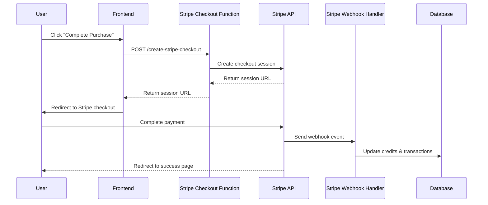
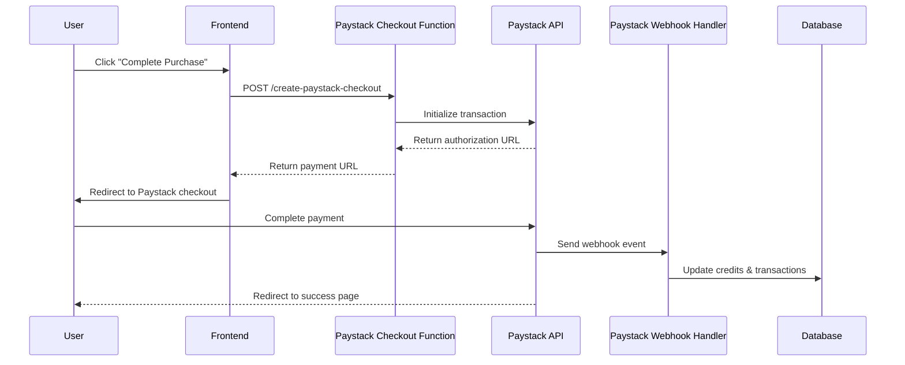
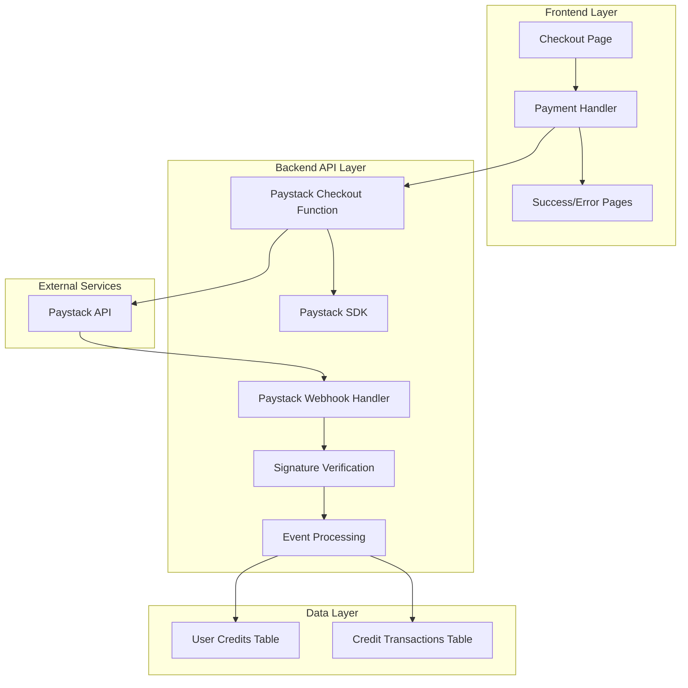

# Design Document: Stripe to Paystack Migration

## Overview

This design document outlines the technical approach for migrating the existing payment system from Stripe to Paystack. The migration involves replacing all Stripe-based payment processing components with Paystack equivalents while maintaining the same user experience and functionality.

The migration encompasses three main areas:
1. **Backend API Migration**: Replace Stripe checkout session creation and webhook processing with Paystack transaction initialization and webhook handling
2. **Frontend Integration Update**: Update client-side payment flow to use Paystack's payment interface
3. **Infrastructure Changes**: Replace Stripe credentials and dependencies with Paystack equivalents

Key design principles:
- **Seamless User Experience**: Users should not notice any difference in the payment flow
- **Data Consistency**: Transaction records and credit system integration must maintain the same structure
- **Security Preservation**: Maintain the same security standards with proper webhook signature verification
- **Error Handling Continuity**: Preserve existing error handling patterns and user feedback mechanisms

## Architecture

### Current Stripe Architecture



### Target Paystack Architecture



### Component Architecture



## Components and Interfaces

### 1. Paystack Checkout Function

**Location**: `supabase/functions/create-paystack-checkout/index.ts`

**Purpose**: Replace the existing Stripe checkout function to initialize Paystack transactions.

**Interface**:
```typescript
// Request
interface PaystackCheckoutRequest {
  userId: string;
  userEmail?: string;
  packageName?: string;
  credits: number;
  price: number;
  successUrl?: string;
  cancelUrl?: string;
}

// Response
interface PaystackCheckoutResponse {
  authorization_url: string;
  access_code: string;
  reference: string;
}
```

**Key Implementation Details**:
- Use Paystack's `/transaction/initialize` endpoint
- Include user metadata (user_id, credits, package_name) in transaction
- Handle Paystack-specific error responses
- Maintain same input validation as Stripe implementation

### 2. Paystack Webhook Handler

**Location**: `supabase/functions/paystack-webhook/index.ts`

**Purpose**: Process Paystack webhook events and update user credits.

**Interface**:
```typescript
// Webhook Event Structure
interface PaystackWebhookEvent {
  event: string;
  data: {
    id: number;
    domain: string;
    status: string;
    reference: string;
    amount: number;
    message?: string;
    gateway_response: string;
    paid_at: string;
    created_at: string;
    channel: string;
    currency: string;
    metadata: {
      user_id: string;
      credits: string;
      package_name: string;
    };
    customer: {
      id: number;
      email: string;
      customer_code: string;
    };
  };
}
```

**Supported Events**:
- `charge.success`: Successful payment completion
- `charge.failed`: Payment failure
- `invoice.payment_failed`: Invoice payment failure (if applicable)

**Key Implementation Details**:
- Verify webhook signature using HMAC SHA512
- Extract metadata from webhook payload
- Update user credits atomically
- Create transaction records with consistent structure
- Handle duplicate webhook events (idempotency)

### 3. Frontend Payment Integration

**Location**: `src/pages/checkout/page.tsx`

**Purpose**: Update frontend to integrate with Paystack checkout flow.

**Key Changes**:
- Replace Stripe checkout API call with Paystack checkout endpoint
- Update payment processing flow to handle Paystack responses
- Maintain existing UI/UX patterns
- Handle Paystack-specific error messages

**Implementation Approach**:
```typescript
const handlePaystackCheckout = async () => {
  try {
    const response = await fetch('/functions/v1/create-paystack-checkout', {
      method: 'POST',
      headers: { 'Content-Type': 'application/json' },
      body: JSON.stringify({
        userId: user.id,
        userEmail: formData.email,
        packageName: `${totalCredits} Credits`,
        credits: totalCredits,
        price: totalPrice,
        successUrl: `${window.location.origin}/checkout/success`,
        cancelUrl: `${window.location.origin}/pricing?purchase=cancelled`
      })
    });
    
    const { authorization_url } = await response.json();
    window.location.href = authorization_url;
  } catch (error) {
    setPaymentError('Payment processing failed. Please try again.');
  }
};
```

### 4. Paystack SDK Integration

**Purpose**: Provide server-side Paystack API integration.

**SDK Choice**: Use `paystack-sdk` npm package for TypeScript support and modern features.

**Key Operations**:
- Transaction initialization
- Transaction verification
- Webhook signature verification

**Implementation**:
```typescript
import { Paystack } from 'paystack-sdk';

const paystack = new Paystack(process.env.PAYSTACK_SECRET_KEY);

// Initialize transaction
const transaction = await paystack.transaction.initialize({
  email: userEmail,
  amount: price * 100, // Convert to kobo/cents
  reference: generateReference(),
  metadata: {
    user_id: userId,
    credits: credits.toString(),
    package_name: packageName
  },
  callback_url: successUrl
});
```

## Data Models

### Transaction Data Structure

The migration will preserve the existing transaction data structure to maintain compatibility with existing queries and reporting:

```sql
-- Existing credit_transactions table structure (preserved)
CREATE TABLE credit_transactions (
  id SERIAL PRIMARY KEY,
  user_id UUID NOT NULL,
  type VARCHAR(50) NOT NULL, -- 'purchase', 'usage', etc.
  credits INTEGER NOT NULL,
  amount DECIMAL(10,2), -- Amount in dollars
  description TEXT,
  status VARCHAR(20) NOT NULL, -- 'completed', 'failed', 'pending'
  created_at TIMESTAMP WITH TIME ZONE DEFAULT NOW(),
  
  -- Additional fields for Paystack integration
  paystack_reference VARCHAR(100), -- Paystack transaction reference
  paystack_transaction_id BIGINT -- Paystack transaction ID
);
```

### Metadata Mapping

**Stripe to Paystack Metadata Mapping**:
- `user_id` → `user_id` (unchanged)
- `credits` → `credits` (unchanged)
- `package_name` → `package_name` (unchanged)

**Additional Paystack Fields**:
- `reference`: Unique transaction reference
- `access_code`: Paystack access code for transaction
- `authorization_url`: Payment page URL

## Error Handling

### Error Categories and Responses

1. **Configuration Errors**:
   - Missing Paystack credentials
   - Invalid API keys
   - Response: 500 with configuration error message

2. **Validation Errors**:
   - Missing required fields (userId, credits, price)
   - Invalid parameter values
   - Response: 400 with specific validation error

3. **Paystack API Errors**:
   - Network timeouts
   - API rate limits
   - Invalid requests
   - Response: 502/503 with user-friendly error message

4. **Webhook Processing Errors**:
   - Invalid signature verification
   - Malformed webhook payload
   - Database update failures
   - Response: 400/500 with appropriate error codes

### Error Handling Strategy

```typescript
// Centralized error handling for Paystack operations
class PaystackErrorHandler {
  static handleApiError(error: any): Response {
    if (error.code === 'NETWORK_ERROR') {
      return new Response(
        JSON.stringify({ error: 'Payment service temporarily unavailable' }),
        { status: 503 }
      );
    }
    
    if (error.code === 'INVALID_CREDENTIALS') {
      return new Response(
        JSON.stringify({ error: 'Payment configuration error' }),
        { status: 500 }
      );
    }
    
    return new Response(
      JSON.stringify({ error: 'Payment processing failed' }),
      { status: 400 }
    );
  }
}
```

## Testing Strategy

### Unit Testing Approach

**Test Categories**:
1. **API Integration Tests**: Test Paystack API calls with mocked responses
2. **Webhook Processing Tests**: Test webhook signature verification and event processing
3. **Credit System Tests**: Test credit updates and transaction record creation
4. **Error Handling Tests**: Test various error scenarios and responses

**Testing Framework**: Use existing test setup with Jest/Vitest

**Key Test Cases**:
- Successful transaction initialization
- Webhook signature verification (valid/invalid)
- Credit balance updates (new user/existing user)
- Transaction record creation
- Error handling for various failure scenarios

### Integration Testing

**Test Environment**: Use Paystack test mode with test API keys

**Test Scenarios**:
1. End-to-end payment flow with test cards
2. Webhook event processing with test events
3. Credit system integration verification
4. Error handling with simulated failures

**Test Data**: Use Paystack test cards for different scenarios:
- Successful payment: `4084084084084081`
- Declined payment: `4084080000005408`
- PIN validation: `5078507850785078`

### Property-Based Testing Assessment

This migration involves payment processing infrastructure changes rather than algorithmic logic that would benefit from property-based testing. The core operations are:
- API integrations with external services (Paystack)
- Database CRUD operations
- Configuration and environment setup

**PBT is NOT appropriate** for this feature because:
- The functionality primarily involves external service integration
- Most operations are side-effect heavy (API calls, database updates)
- The behavior doesn't vary meaningfully with input in ways that would benefit from property testing
- Integration tests and example-based unit tests are more valuable for this type of infrastructure change

**Alternative Testing Strategies**:
- **Integration tests** with Paystack test environment
- **Mock-based unit tests** for API integration logic
- **Example-based tests** for webhook processing scenarios
- **End-to-end tests** for complete payment flows

## Security Considerations

### Webhook Security

**Signature Verification**:
```typescript
import crypto from 'crypto';

function verifyPaystackSignature(payload: string, signature: string, secret: string): boolean {
  const hash = crypto
    .createHmac('sha512', secret)
    .update(payload)
    .digest('hex');
  
  return hash === signature;
}
```

**IP Whitelisting**: Configure firewall/security groups to only allow webhook requests from Paystack IPs:
- 52.31.139.75
- 52.49.173.169
- 52.214.14.220

### API Security

**Environment Variables**:
- `PAYSTACK_PUBLIC_KEY`: Client-side integration
- `PAYSTACK_SECRET_KEY`: Server-side API calls
- `PAYSTACK_WEBHOOK_SECRET`: Webhook signature verification

**Security Headers**:
- Maintain existing CORS configuration
- Use HTTPS for all API communications
- Implement rate limiting for webhook endpoints

### Data Protection

**Sensitive Data Handling**:
- Never log payment card details
- Mask sensitive information in logs
- Use secure environment variable storage
- Implement proper error messages that don't expose system internals

## Deployment Strategy

### Migration Phases

**Phase 1: Preparation**
1. Set up Paystack account and obtain API keys
2. Create new Paystack functions alongside existing Stripe functions
3. Update environment configuration
4. Deploy to staging environment

**Phase 2: Testing**
1. Run comprehensive test suite
2. Perform end-to-end testing with Paystack test cards
3. Validate webhook processing with test events
4. Verify credit system integration

**Phase 3: Production Deployment**
1. Deploy Paystack functions to production
2. Update frontend to use new Paystack endpoints
3. Configure production webhook URLs in Paystack dashboard
4. Monitor initial transactions closely

**Phase 4: Cleanup**
1. Remove Stripe functions and dependencies
2. Clean up Stripe environment variables
3. Update documentation and monitoring

### Rollback Strategy

**Immediate Rollback**: Keep Stripe functions available during initial deployment for quick rollback if issues arise.

**Rollback Triggers**:
- Payment processing failures > 5%
- Webhook processing errors
- Credit system inconsistencies
- User experience degradation

### Monitoring and Alerting

**Key Metrics**:
- Payment success rate
- Webhook processing success rate
- Credit update accuracy
- API response times
- Error rates by category

**Alerting Thresholds**:
- Payment failure rate > 2%
- Webhook processing failure rate > 1%
- API response time > 5 seconds
- Any configuration errors

## Performance Considerations

### API Performance

**Paystack API Characteristics**:
- Similar response times to Stripe
- Rate limiting: 100 requests per second
- Webhook delivery: 3-minute intervals for retries

**Optimization Strategies**:
- Implement request caching where appropriate
- Use connection pooling for database operations
- Optimize webhook processing for quick 200 OK responses

### Database Performance

**Transaction Processing**:
- Use database transactions for credit updates
- Implement proper indexing on user_id and transaction references
- Consider connection pooling for high-volume scenarios

### Frontend Performance

**Payment Flow Optimization**:
- Minimize API calls during checkout
- Implement proper loading states
- Cache payment configuration where possible

## Maintenance and Support

### Documentation Updates

**Required Documentation Changes**:
- Update API documentation to reflect Paystack endpoints
- Create Paystack integration guide for developers
- Update troubleshooting guides with Paystack-specific issues
- Document new environment variables and configuration

### Support Considerations

**Common Issues and Solutions**:
1. **Webhook Signature Failures**: Verify webhook secret configuration
2. **Payment Redirects**: Ensure callback URLs are properly configured
3. **Credit Updates**: Check metadata extraction from webhook events
4. **Test vs Live Mode**: Verify correct API keys for environment

### Monitoring and Maintenance

**Regular Maintenance Tasks**:
- Monitor Paystack API status and updates
- Review webhook delivery success rates
- Validate credit system accuracy
- Update test cards and scenarios as needed

**Long-term Considerations**:
- Stay updated with Paystack API changes
- Monitor payment success rates and user feedback
- Consider additional Paystack features (subscriptions, transfers)
- Plan for potential future payment provider migrations